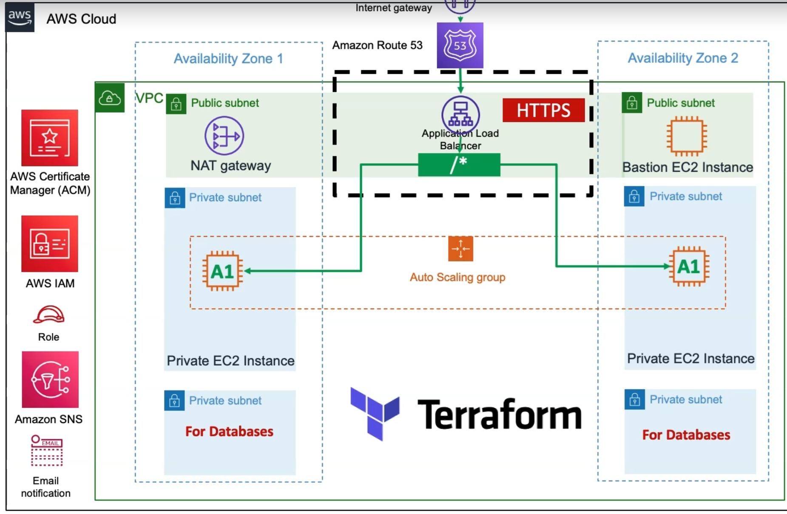

# AWS 3-Tier High-Availability Infrastructure

This repository contains Terraform configurations to deploy a resilient, three-tier web architecture on AWS. It hosts three distinct applications behind a single Application Load Balancer (ALB) with a persistent RDS backend and automated scaling.

## 🏗 Architecture Diagram



The infrastructure is partitioned into three distinct layers across multiple Availability Zones (AZs):
- **Public Tier:** Application Load Balancer (ALB) and NAT Gateway for outbound traffic.
- **App Tier (Private):** EC2 instances within Auto Scaling Groups (ASGs). Only accessible via the ALB.
- **Database Tier (Private):** Amazon RDS instance with Multi-AZ enabled. Only accessible from the App Tier.

## 🛣 Routing Logic

The ALB uses path-based listener rules to forward traffic to the appropriate application fleet:

| Path | Target Group | Application | Port |
| :--- | :--- | :--- | :--- |
| `/app1*` | `mytg1` | App 1 (Frontend) | 80 |
| `/app2*` | `mytg2` | App 2 (Internal) | 80 |
| `/*` (Default) | `mytg3` | App 3 (Landing) | 8080 |

## 🚀 Scaling Strategy

We utilize **Target Tracking Scaling Policies** to ensure the fleet size matches real-time demand.


1. **CPU Tracking:** Monitors `ASGAverageCPUUtilization`. Scales out when average CPU exceeds **50%**.
2. **Request Tracking:** Monitors `ALBRequestCountPerTarget`. This is highly responsive to traffic spikes, scaling the fleet before CPU usage catches up.

## 📂 Project Structure (High-level)

```text
.
├── providers.tf        # AWS Provider and Versioning
├── vpc.tf              # VPC Module (Public/Private/DB Subnets & NAT)
├── alb.tf              # ALB Module & Path-based Listener Rules
├── rds.tf              # RDS Instance & Subnet Group Configuration
├── security-groups.tf  # SG Rules (ALB -> App -> DB)
├── asg-apps.tf         # ASG & Launch Templates for Apps 1, 2, and 3
├── scaling-policy.tf   # Target Tracking Policies (CPU & Requests)
└── variables.tf        # Environment variables and naming